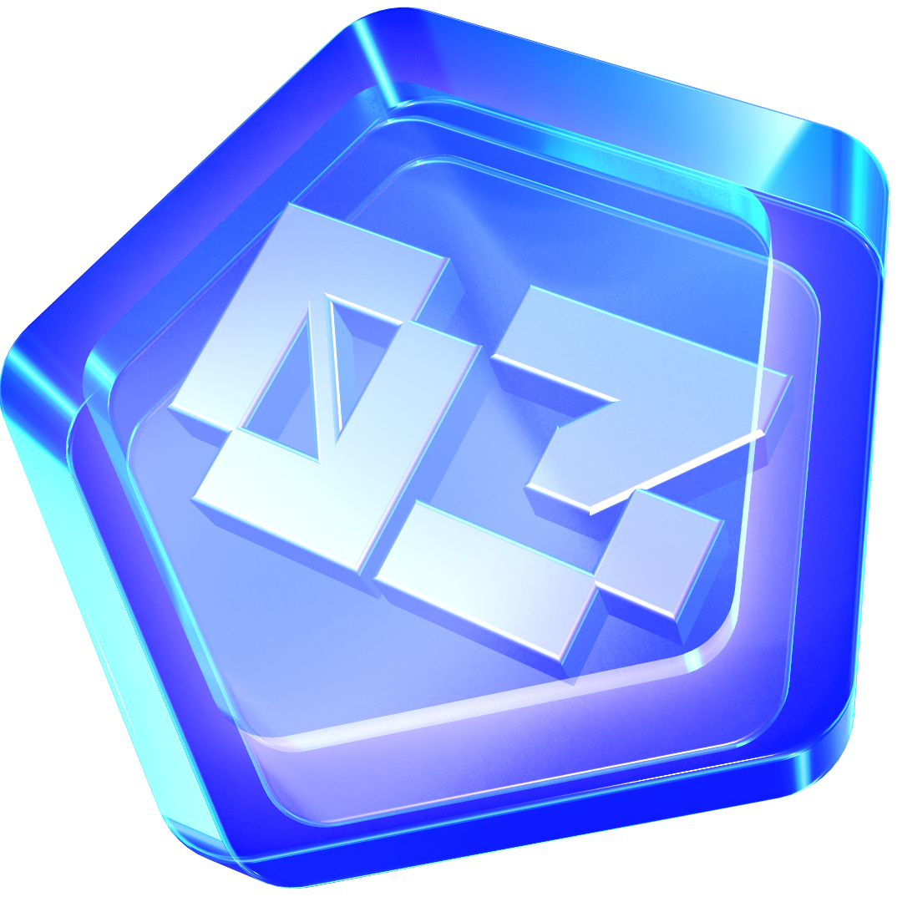

   

# Score NFT - SeaDrop

NFT Awarded for Soneium Score participants with 80+ points during each Season.

* Season 1 Mint on [OpenSea](https://opensea.io/collection/soneium-score-season-1-badge/overview), minted 31995(32406) tokens
* Season 2 Mint on [OpenSea](https://opensea.io/collection/soneium-score-season2-badge/overview), minted 55940(58089) tokens
* Season 3 Mint on [OpenSea](https://opensea.io/collection/soneium-score-season3-badge/overview), minted 37564(38446) tokens
* Season 4 Mint on [OpenSea](https://opensea.io/collection/soneium-score-season4-badge/overview), minted 0(27000) tokens
* Season 5 Mint on [OpenSea](https://opensea.io/collection/soneium-score-season5-badge/overview), minted 0(27000) tokens
* Season 6 Mint on [OpenSea](), minted 0(27000) tokens

## Contracts

* Score Season1 NFT on [Blockscout](https://soneium.blockscout.com/address/0x05AB5e724848cEFeac6D303CDf94032E5Cc3552B?tab=txs).
* Score Season2 NFT on [Blockscout](https://soneium.blockscout.com/address/0x6b2f6d8216e075d3a71f4aaf21d7158af9b8dc82?tab=txs).
* Score Season3 NFT on [Blockscout](https://soneium.blockscout.com/address/0x7BF02b42b9d4cCD85b497C9F53e6b7474f9c2546?tab=txs).
* Score Season4 NFT on [Blockscout](https://soneium.blockscout.com/address/0x17121f9a7041FFe3EF248F7b84658d9229bad64f?tab=txs).
* Score Season5 NFT on [Blockscout](https://soneium.blockscout.com/address/0xd8d14f829665183049707e0bdd93f9012bb3c4c2).
* Score Season6 NFT on [Blockscout](https://soneium.blockscout.com/address/0xe5a3d28fe65895d7cd7146fb50199b85fba74c3e).